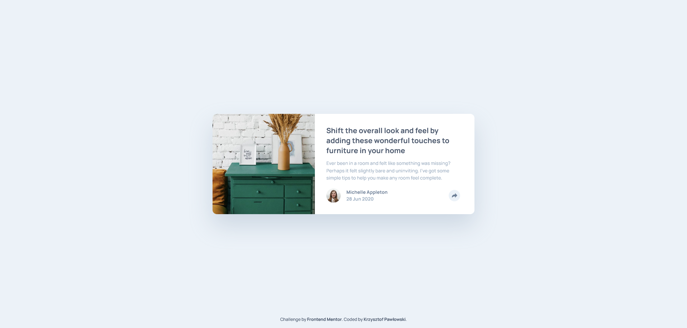

# Frontend Mentor - Article preview component solution

This is a solution to the [Article preview component challenge on Frontend Mentor](https://www.frontendmentor.io/challenges/article-preview-component-dYBN_pYFT). Frontend Mentor challenges help you improve your coding skills by building realistic projects.

## Table of contents

- [Overview](#overview)
  - [The challenge](#the-challenge)
  - [Screenshot](#screenshot)
  - [Links](#links)
- [My process](#my-process)
  - [Built with](#built-with)
  - [Continued development](#continued-development)
  - [Useful resources](#useful-resources)
- [Author](#author)

## Overview

### The challenge

Users should be able to:

- View the optimal layout for the component depending on their device's screen size
- See the social media share links when they click the share icon

### Screenshot

### Links

- Solution URL: [article-preview-component](https://github.com/KP1976/article-preview-component)
- Live Site URL: [article-preview-component](https://kp1976.github.io/article-preview-component/)

## My process

### Built with

- Semantic HTML5 markup
- CSS custom properties
- Flexbox
- CSS Grid
- Mobile-first workflow
- [React](https://reactjs.org/) - JS library
- [CSS Modules](https://create-react-app.dev/docs/adding-a-css-modules-stylesheet/) - For styles

### Useful resources

- [woff2 fonts](https://gwfh.mranftl.com/fonts/red-hat-display?subsets=latin) - This helped me get .woff2 fonts. I really liked this site.
- [Penpot](https://penpot.app/) - This is an amazing alternative for figma. I do most of my projects in this application.

## Author

- Website - [Portfolio](https://portfoliokp1976.vercel.app/)
- Frontend Mentor - [@KP1976](https://www.frontendmentor.io/profile/KP1976)
- GitHub - [KP1976](https://github.com/KP1976)
